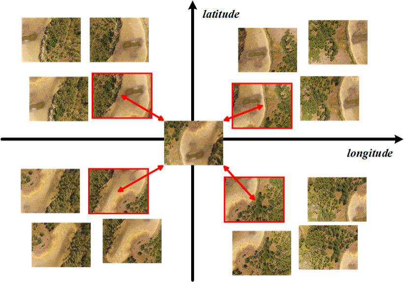
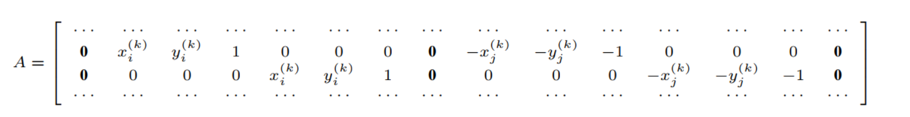

# Efficient-Superpixel-based-Large-scale-Image-Stitching-Registration-Part
## Algorithm details
Our global registration optimization method has two main steps: feature matching and transformation optimization.

1) **Feature matching**

For each image, we select its 4 nearest neighbors based on GPS coordinates. Specifically, as shown in following figure, we define a coordinate system centered on each image using latitude and longitude as axes. These axes divide the coverage area into 4 equal-sized zones. To ensure registration quality across all orientations and avoid selecting multiple neighbors from a single direction, we choose the closest neighbor from each zone.Following figure illustrates that each image can have up to 4 pairs of neighboring images. Subsequently, redundant neighboring images are removed. And we apply the Scale Invariant Feature Transform (SIFT) algorithm to perform feature matching and the Random Sample Consensus (RANSAC) algorithm to eliminate outliers for each pair of neighboring images.

2) **Transformation optimization**

Assuming a total of N images to be stitched. Let *Ii* be the ith image (i = 1, · · · , N) and *Ti* be its affine transformation matrix, which is 2 × 3 matrix. To ensure aligned images are geometrically consistent, the location of transformed matching points should be close in global coordinate system. Thus, we use coordinates of matching points to construct our linear registration optimization function.

For a matching image pair (*Ii*, *Ij*), the following two equations can be constructed using the homography model:

*[xi(k), yi(k), 1]* $\cdot$ *Ti1* = *[xj(k), yj(k), 1]* $\cdot$ *Tj1*

*[xi(k), yi(k), 1]* $\cdot$ *Ti2* = *[xj(k), yj(k), 1]* $\cdot$ *Tj2*

where (*xi(k)*, *yi(k)*) denotes the coordinate of the kth matching point in image *Ii* and *Tir* represents the rth row of Ti (i.e., r = (1, 2)).

By stacking above equations for all the matching image pairs, the optimal affine transformation problem can be formulated as

*AX = 0*

where *A* and *X* are constructed as following, respectively.

*X = [T11, T12, ..., TN1, TN2]T*

Subsequently, the optimal affine transformation can be determined by employing linear least square algorithm to solve *AX = 0*.

## Registration Performance
### Dataset details
We evaluate our algorithm on 5 image datasets, which are all captured by Phantom 3 Advanced drone with resolution of 4000 × 3000 and available in Dronemapper website[6]. We also propose an efficient matching image pair selection method. The image number and selected image pair number is shown following.

<table style="width:100%">
  <tr>
    <th>Dataset</th>
    <th>Number of images</th>
    <th>Number of matching image pair</th>
  </tr>
   </tr>
  <tr>
    <td>Gregg</td>
    <td>187</td>
    <td>338</td>
  </tr>
  <tr>
    <td>Golf Course</td>
    <td>664</td>
    <td>1424</td>
  </tr>
  <tr>
    <td>4thAveReservoir</td>
    <td>82</td>
    <td>158</td>
  </tr>
  <tr>
    <td>AdobeButtes1</td>
    <td>160</td>
    <td>310</td>
  </tr>
  <tr>
    <td>AdobeButtes2</td>
    <td>371</td>
    <td>748</td>
  </tr>
</table>

We evaluate our registration quality with MegaStitch[2] and MGRAPH[1]. Compared to their method, our method has least optimization term number and best RMSE performance.

### Optimization term number
<table style="width:100%">
  <tr>
    <th>Dataset</th>
    <th>MGRAPH</th>
    <th>MegaStitch affine</th>
    <th>MegaStitch bundle adjustmnet</th>
    <th>Ours</th>
  </tr>
   </tr>
  <tr>
    <td>Gregg</td>
    <td>21246</td>
    <td>28826</td>
    <td>14410</td>
    <td><b>13520</b></td>
  </tr>
  <tr>
    <td>Golf Course</td>
    <td>88268</td>
    <td>118194</td>
    <td>59094</td>
    <td><b>56960</b></td>
  </tr>
  <tr>
    <td>4thAveReservoir</td>
    <td>9812</td>
    <td>13426</td>
    <td>6710</td>
    <td><b>6320</b></td>
  </tr>
  <tr>
    <td>AdobeButtes1</td>
    <td>20534</td>
    <td>27708</td>
    <td>13851</td>
    <td><b>12400</b></td>
  </tr>
  <tr>
    <td>AdobeButtes2</td>
    <td>46547</td>
    <td>62650</td>
    <td>31322</td>
    <td><b>29920</b></td>
  </tr>
</table>

### Registration quality (RMSE) 
<table style="width:100%">
  <tr>
    <th>Dataset</th>
    <th>MGRAPH</th>
    <th>MegaStitch</th>
    <th>Ours</th>
  </tr>
   </tr>
  <tr>
    <td>Gregg</td>
    <td>7.57</td>
    <td>2.31</td>
    <td><b>2.23</b></td>
  </tr>
  <tr>
    <td>Golf Course</td>
    <td>3.81</td>
    <td>1.65</td>
    <td><b>1.52</b></td>
  </tr>
  <tr>
    <td>4thAveReservoir</td>
    <td>2.60</td>
    <td>1.94</td>
    <td><b>1.62</b></td>
  </tr>
  <tr>
    <td>AdobeButtes1</td>
    <td>2.27</td>
    <td>1.52</td>
    <td><b>1.41</b></td>
  </tr>
  <tr>
    <td>AdobeButtes2</td>
    <td>5.91</td>
    <td>1.51</td>
    <td><b>1.47</b></td>
  </tr>
</table>

As for efficiency analysis, we add software MetaShape[3] for comparison.

### Registration efficiency (transformation optimization time) 
<table style="width:100%">
  <tr>
    <th>Dataset</th>
    <th>MGRAPH</th>
    <th>MegaStitch</th>
    <th>MetaShape*</th>
    <th>Ours</th>
  </tr>
   </tr>
  <tr>
    <td>Gregg</td>
    <td>16m43s</td>
    <td>21s</td>
    <td>1m46s</td>
    <td><b>7s</b></td>
  </tr>
  <tr>
    <td>Golf Course</td>
    <td>5h13m25s</td>
    <td>6m30s</td>
    <td>12m1s</td>
    <td><b>4m4s</b></td>
  </tr>
  <tr>
    <td>4thAveReservoir</td>
    <td>3m14s</td>
    <td>3s</td>
    <td>1m11s</td>
    <td><b>1s</b></td>
  </tr>
  <tr>
    <td>AdobeButtes1</td>
    <td>16m14s</td>
    <td>9s</td>
    <td>2m19s</td>
    <td><b>4s</b></td>
  </tr>
  <tr>
    <td>AdobeButtes2</td>
    <td>1h28m58s</td>
    <td>1m59s</td>
    <td>6m29s</td>
    <td><b>31s</b></td>
  </tr>
</table>
* Running time of MetaShape "align images" step, which include feature feature extraction and matching. Thus, this part of time is for reference only.

## Reference

1. Ruiz, J.J., Caballero, F., & Merino, L. (2018). MGRAPH: A Multigraph Homography Method to Generate Incremental Mosaics in Real-Time From UAV Swarms. IEEE Robotics and Automation Letters, 3, 2838-2845.

2. Zarei, A., Gonzalez, E., Merchant, N., Pauli, D., Lyons, E., & Barnard, K. (2022). MegaStitch: Robust Large-Scale Image Stitching. IEEE Transactions on Geoscience and Remote Sensing, 60, Article 4408309. https://doi.org/10.1109/TGRS.2022.3141907

3. Agisoft, “Agisoft metashape.” [Online]. Available: https://www.agisoft.cn

4. M. A. Fischler and R. C. Bolles, “Random sample consensus: A paradigm for model fitting with applications to image analysis and automated cartography,” Commun. ACM, vol. 24, no. 6, p. 381–395, jun 1981.

5. D. G. Lowe, “Distinctive image features from scale-invariant keypoints,” Int. J. Comput. Vision, vol. 60, no. 2, p. 91–110, nov 2004.

6. “Dronemapper,” accessed: June. 12, 2023. [Online]. Available: https://dronemapper.com/sample_data/

